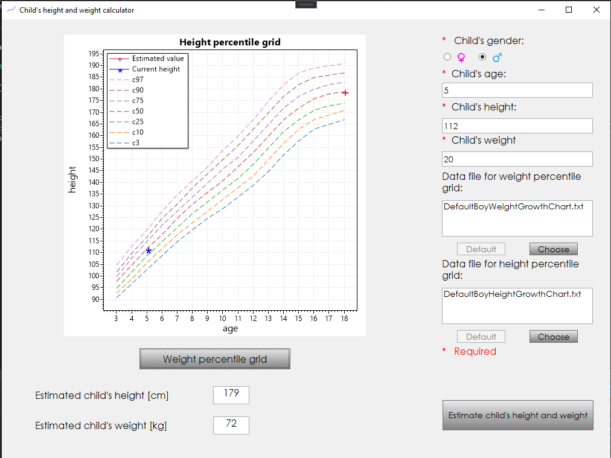
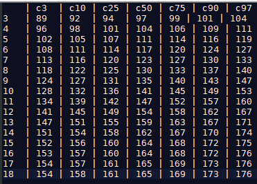

# Child parameters calculator
Simple desktop application for calculating child height and weight created with WPF framework.

## Table of contents
* [General info](#general-info)
* [Technologies](#technologies)
* [Setup](#setup)
* [Current features](#current-features)
* [Possible improvements](#possible-improvements)

## General info
Application was created as an individual project during studies. 
It allows you to estimate child's parameters such as height and weight. 
Calculations are based on the percentile grids created during the researches "Ola" and "Olaf" in years 2007-2012.
[[link to source](http://www.zscielcza.pl/?q=uczen/edukacja/centyle "Source")]

## Technologies
Application uses following technologies:

* __C# 7.3__
* __.NET Framework 4.7.2__
* __ScottPlot WPF 4.0.48__ - [Github](https://github.com/ScottPlot/ScottPlot)
* __NUnit  3.13.2__

## Setup

All you need to do is clone the repository and build the project.
The project provides the default data. If you prefer a different one, just select file from dialog window. 
Data file should follow some rules:

* Data file should be with .txt extension.
* First line defines the labels in the charts.
* First value in a line should be the child's age. These values can't be non-decreasing in relation to the previous lines.
* Subsequent values in the lines should describe the child's parameters.
* All values should be positive integers separated by a '|' character with any (reasonable) number of tabs and spaces.

Example data file:

## Current features

* Calculating the height and weight of a child at the age of 18.
* Showing result on percentile grids.
* Choosing child's gender.
* Software localization (currently only implemented in Polish and English).
* Unit tests.
* User input validation.

## Possible improvements

Project is finished and application is not planned to be developed in near future. Even though there are many possible improvements such as:
* Beautification of the visual layer (more colorful).
* Creating a variant of estimating the height and weight of children aged 0-3 years.
* Adding a localization to other languages (e.g. German)
